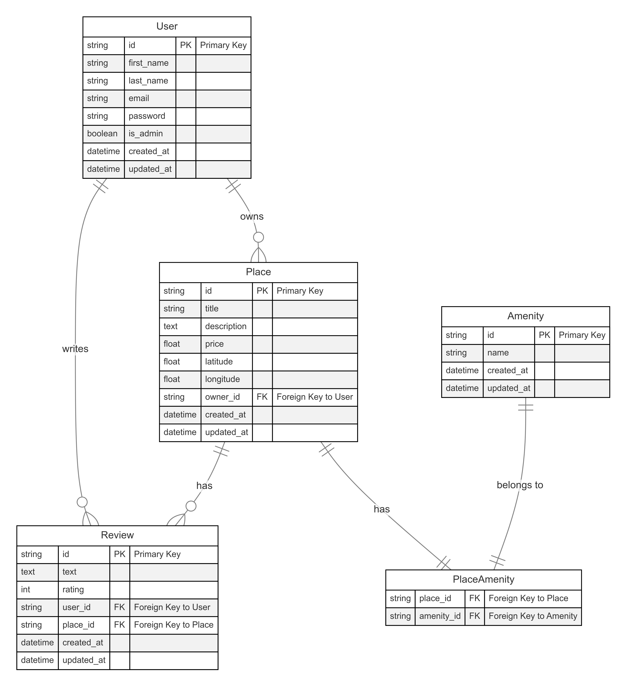

# HBnB - Holberton Bed and Breakfast

[](https://www.sqlalchemy.org/)
[](https://flask.palletsprojects.com/)
[](https://www.sqlite.org/)

## 📋 Overview

HBnB (Holberton Bed and Breakfast) is a web application for managing accommodations and bookings. This repository contains Part 3 of the project, focusing on **Database Implementation** using SQLAlchemy ORM and raw SQL.

## 🗄️ Database Schema



The database consists of four main entities with the following relationships:
- **User** → **Place**: One-to-many (A user can own many places)
- **User** → **Review**: One-to-many (A user can write many reviews)
- **Place** → **Review**: One-to-many (A place can have many reviews)
- **Place** ↔ **Amenity**: Many-to-many (Places have amenities; amenities belong to places)

## 🚀 Getting Started

### Prerequisites
- Python 3.8+
- SQLite3
- Flask
- SQLAlchemy

### Installation

1. Clone the repository:
   ```
   git clone https://github.com/JaysonPasquier/holbertonschool-hbnb.git
   cd holbertonschool-hbnb/part3
   ```

2. Create and activate a virtual environment:
   ```
   python -m venv venv
   source venv/bin/activate  # On Windows use `venv\Scripts\activate`
   ```

3. Install dependencies:
   ```
   pip install -r requirements.txt
   ```

### Database Setup

#### Option 1: Using SQL Scripts
```bash
# Create database schema
sqlite3 hbnb.db < create_tables.sql

# Add initial data
sqlite3 hbnb.db < insert_initial_data.sql

# Verify setup
sqlite3 hbnb.db < verify_database.sql
```

#### Option 2: Using Python Scripts
```bash
# Create database tables
python init_db.py create

# Add sample data
python init_db.py seed
```

## 🏃‍♂️ Running the Application

Start the Flask server:
```bash
python run.py
```

Access the API documentation at: http://localhost:5000/api/v1/

## 🧪 Testing

Run all tests:
```bash
python run_tests.py
```

## 📁 Project Structure

```
part3/
├── app/                    # Application code
│   ├── api/                # API endpoints and serialization
│   ├── models/             # SQLAlchemy models (entities)
│   ├── persistence/        # Data access layer (repositories)
│   └── services/           # Business logic and facades
├── tests/                  # Test files
├── *.sql                   # SQL scripts for database management
├── config.py               # Application configuration
├── init_db.py              # Database initialization utility
├── run.py                  # Application entry point
└── database_diagram.md     # Mermaid diagram source
```

## 📚 Key Features

### 1. SQLAlchemy ORM Models
- **User**: Account management with authentication
- **Place**: Property listings with location and price
- **Review**: User reviews for places with ratings
- **Amenity**: Features that can be associated with places

### 2. Repository Pattern
- Abstraction of data access logic
- Support for different storage backends
- Clean separation of concerns

### 3. SQL Scripts
- `create_tables.sql`: Database schema creation
- `insert_initial_data.sql`: Seeding initial data
- `verify_database.sql`: Validation of database structure
- `sample_queries.sql`: Example queries demonstrating relationships

### 4. API Endpoints
- **Users**: `/api/v1/users/` - Account management
- **Places**: `/api/v1/places/` - Property listings
- **Reviews**: `/api/v1/reviews/` - User reviews
- **Amenities**: `/api/v1/amenities/` - Place features

## ✅ Tasks Completed

- [x] **Task 8**: Map the Place, Review, and Amenity Entities
- [x] **Task 9**: Map Relationships Between Entities Using SQLAlchemy
- [x] **Task 10**: SQL Scripts for Table Generation and Initial Data
- [x] **Task 11**: Generate Database Diagrams

## 📊 ER Diagram (Interactive)

To view the interactive ER diagram:
1. Open the `database_diagram.md` file
2. Use a Markdown viewer that supports Mermaid diagrams
3. Or paste the code into [Mermaid Live Editor](https://mermaid.live/)

## 📚 Resources

- [SQLAlchemy Documentation](https://docs.sqlalchemy.org/)
- [Flask-SQLAlchemy](https://flask-sqlalchemy.palletsprojects.com/)
- [Mermaid.js Diagram Syntax](https://mermaid-js.github.io/mermaid/#/)
