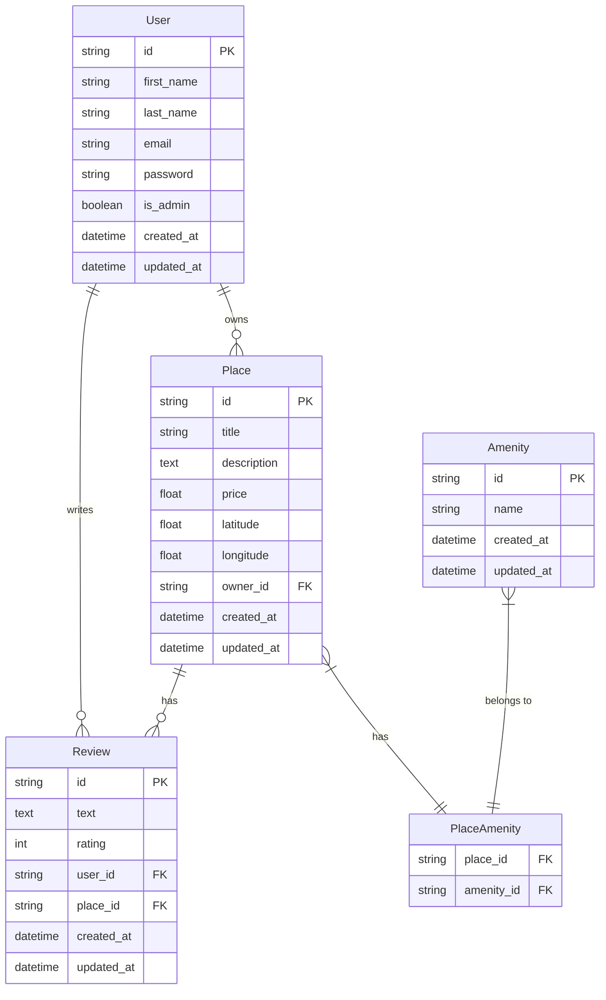
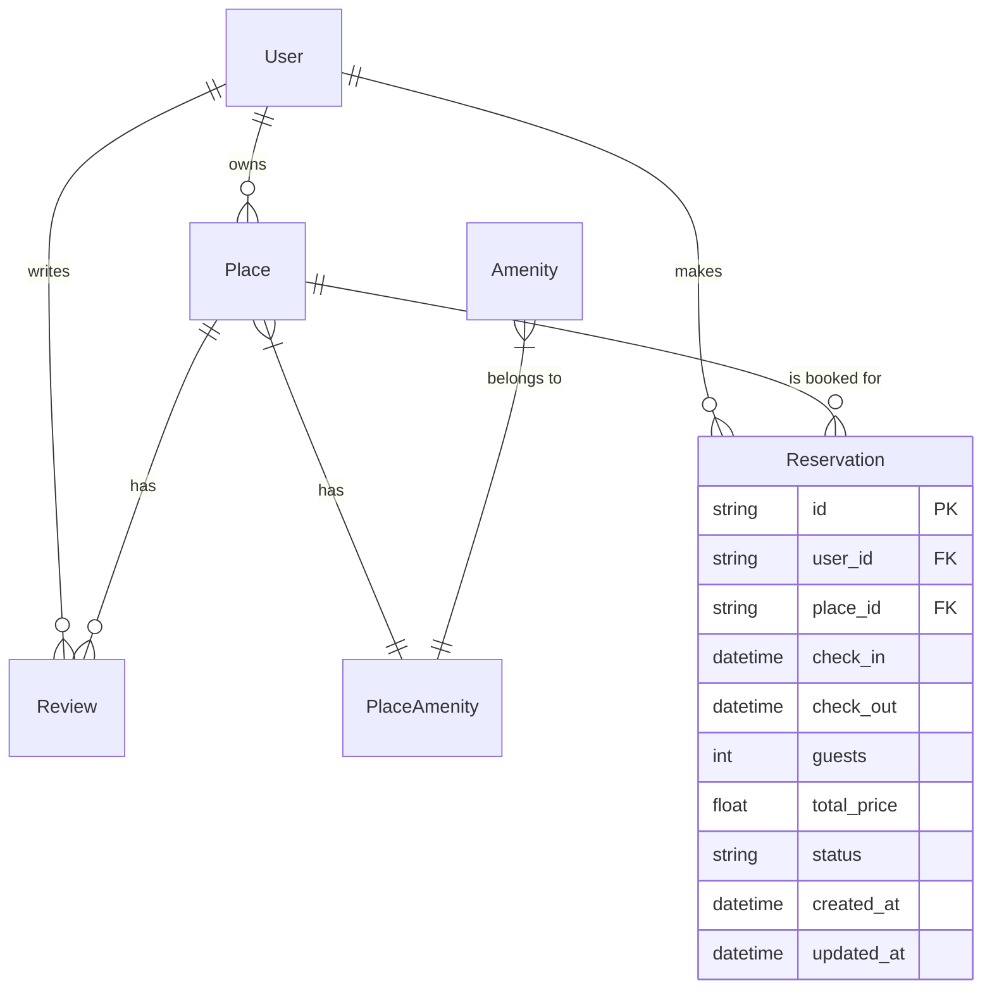

# HBnB Database Schema Diagram

## Entity-Relationship Diagram

## Schema Description

The diagram above represents the HBnB database schema with the following entities and relationships:

### Entities

1. **User**
   - Primary attributes: id, first_name, last_name, email, password, is_admin
   - Represents users who can own places and write reviews

2. **Place**
   - Primary attributes: id, title, description, price, latitude, longitude
   - Foreign key: owner_id (references User)
   - Represents accommodations that can be listed

3. **Review**
   - Primary attributes: id, text, rating (1-5)
   - Foreign keys: user_id (references User), place_id (references Place)
   - Represents user reviews for places
   - Has a unique constraint on (user_id, place_id) to ensure one review per user per place

4. **Amenity**
   - Primary attributes: id, name
   - Represents features that places may have (WiFi, Pool, etc.)

5. **PlaceAmenity**
   - Join table for the many-to-many relationship between Place and Amenity
   - Composite primary key of place_id and amenity_id

### Relationships

1. **User to Place**: One-to-many (A user can own multiple places)
2. **User to Review**: One-to-many (A user can write multiple reviews)
3. **Place to Review**: One-to-many (A place can have multiple reviews)
4. **Place to Amenity**: Many-to-many through PlaceAmenity (A place can have many amenities; an amenity can belong to many places)

## Extended Model (Bonus)

Here's how we might extend the model to include a Reservation entity:

The Reservation entity would track bookings with:
- Foreign keys to both User (who made the reservation) and Place (what was reserved)
- Check-in and check-out dates
- Number of guests and total price
- Booking status (pending, confirmed, completed, cancelled)
